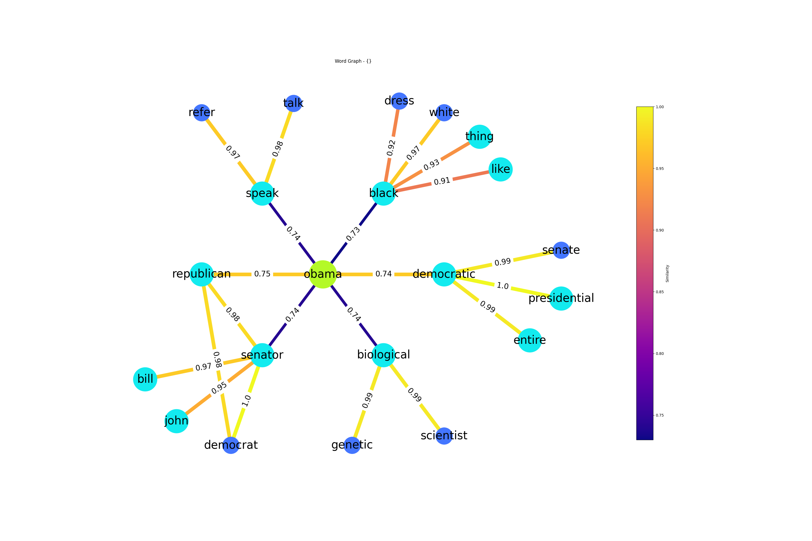

# Semantic shift modelling using GNNs

<p align="center">
  
</p>

## Installation
Clone the repository and install the dependencies using the following commands:

```bash
git clone https://github.com/imene-swaan/Diachronic-embeddings.git
cd Diachronic-embeddings
poetry install
```

## Usage

#### Configuration
The configuration file is located in `config/config.yaml`. Use it to set experiment pipeline and parameters.

#### Run experiment
To run the experiment, use the following command:
```bash
poetry run python -m main
```


